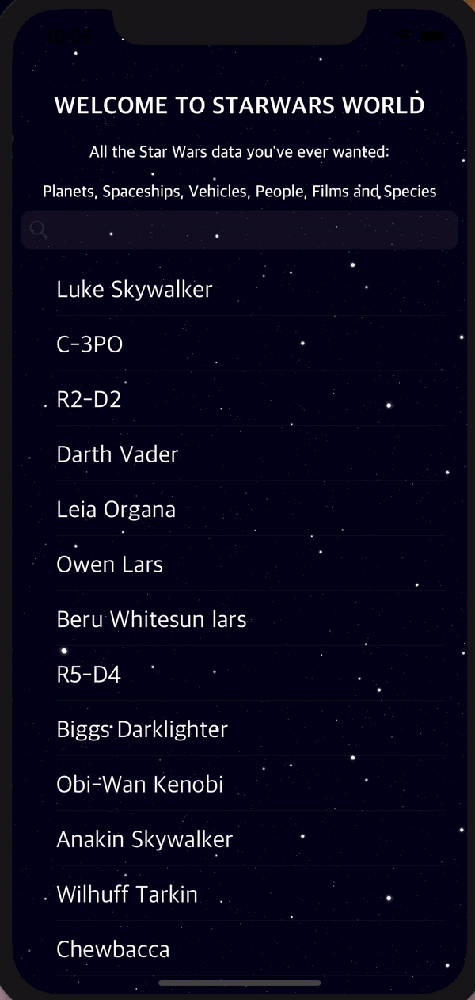

# CourseraStarWarsAPI
Full information about all StarWars characters (all films) which presented in table views using free API 

Files in folder Controllers contains code which presented in main ViewControllers (ex. "MainVC" - main view controller)
File in folder Service containts code provides API requests. 

